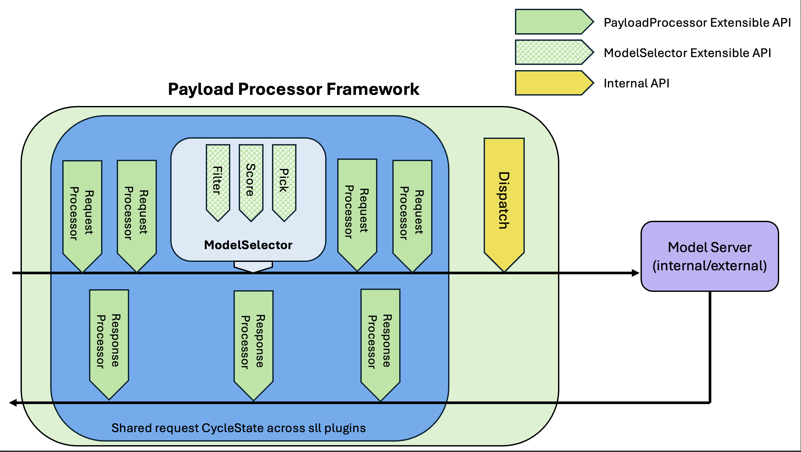

# ModelSelector Architecture

Author(s): @noyitz, @nirrozenbaum

## Proposal Status
 ***Proposed***

## Summary
This proposal introduces a **ModelSelector Framework** for the Inference Payload Processor (IPP) that enables intelligent routing across multiple models (internal/external). The framework adapts the upstream [Scheduler Architecture (proposal 0845)](https://github.com/kubernetes-sigs/gateway-api-inference-extension/tree/main/docs/proposals/0845-scheduler-architecture-proposal), specifically the **Filter/Scorer/Picker** pattern for intelligent model selection.

While the upstream scheduler selects an **endpoint** for a request, the ModelSelector Framework selects a **model** to serve a request. This is based on configuration policies and enables cost optimization, latency-based routing, and future fallback and semantic routing capabilities.

## Design Principles
- The *framework* should be agnostic to model types and K8s concepts.
  - Opinions should be held by the plugins, not the framework
- The entry & exit points are defined by the framework, forming a clear API surface
- The system should be extensible via pluggable ModelSelector components (Filter, Score, Pick)
- State management
  - Per-request state is managed via in-memory state that is shared across plugins during a single selection run
  - Global state is managed by the IPP data layer, and is shared with the plugin

## Definitions
- **ModelSelector Framework** — A pluggable system for implementing model selection logic.
- **ModelSelector Profile** — A configured set of Filter(s), Scorer(s), and a Picker that executes the selection pipeline for a given request.
- **ModelCandidate** — A concrete model option to serve a request. A ModelCandidate may carry both static configuration (e.g., cost per token, priority, labels — set at configuration time) and runtime metrics (e.g., observed latency, rate limit state, error rate — collected during operation). Filters and Scorers use this information to make selection decisions.
- **ModelSelector Plugin** — An implementation of one of the ModelSelector interfaces: Filter, Scorer, or Picker. Distinct from IPP processor plugins (RequestProcessor/ResponseProcessor).

## Proposal

The ModelSelector system is composed of three parts:
- A **framework** that defines the selection pipeline
- The **interfaces** (Filter, Scorer, Picker) that developers implement to add selection logic
- A **configuration API** to define a profile and the plugins used within it

### ModelCandidate

A model that is a candidate to be selected for a given request. 
At the minimum, this should include unique identifier of the model, and collection of attributes that can be used by ModelSelector plugins to either filter or score the model per request. 

### ModelSelector Profile

A Profile consists of 3 phases: `Filter`, `Score`, and `Pick`.

*Profile Constraints*
- A profile can have any number of `Filter` plugins registered (including zero)
- A profile can have any number of `Score` plugins registered (including zero)
- A profile MUST have exactly one `Pick` plugin registered

#### Filter
Filter runs before any scoring, and removes models that are not fit for selection. Some examples:
- Authorization constraints
- Rate limit exhaustion
- Unavailable models

The framework will return an error to the client if the models are filtered to zero.

#### Score
Score applies a score to each remaining model. Scorers SHOULD keep their score values in a normalized range [0-1]. Any weighting should be added at the Profile configuration level. Scorers may use both static data and runtime metrics from the ModelCandidate to compute scores. Examples:
- Cost-based scoring (using per-token cost from static config)
- Latency-based scoring (using observed response times from runtime metrics)

#### Pick
Picker selects the model(s) from the provided list of scored models. Picker MUST return one model at minimum. Examples:
- Highest score wins
- Weighted random sampling (use weighted score as the probability to win)

### Metrics and Runtime Feedback

Filters and Scorers may consume runtime metrics from the data layer stored in-memory. This enables data-driven selection decisions based on observed model behavior (latency, error rates, rate limit status) rather than static configuration alone.

### Example Flow

A user sends `{ "model": "auto" }`. The system loads three candidate models: `llama-70b` (high capability, high cost), `llama-8b` (moderate capability, low cost), and `mistral-7b` (moderate capability, low cost).

- **Filter**: removes `mistral-7b` (rate-limited)
- **Score**: CostScorer ranks `llama-8b` = 0.9 (cheapest), `llama-70b` = 0.3 (most expensive)
- **Pick**: selects `llama-8b`

Result: `llama-8b` is injected into the request body and the request continues through the regular pipeline, the same flow as if the user had sent `{ "model": "llama-8b" }` directly.

## Integration with Payload Processor

The current Payload Processor defines:
- RequestProcessor
- ResponseProcessor

ModelSelector will be introduced as a first class citizen and may be treated as a RequestProcessor, meaning:
- It can run alongside other request processors in the pipeline
- It composes naturally within the existing plugin chain
- It can leverage CycleState to share data across processors

## Configuration API
Configuration API should be defined for PayloadProcessor in general and should address ModelSelector as well.
<!-- TODO -->
